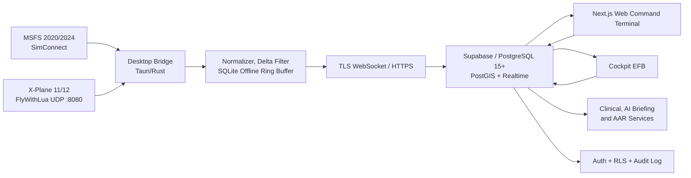
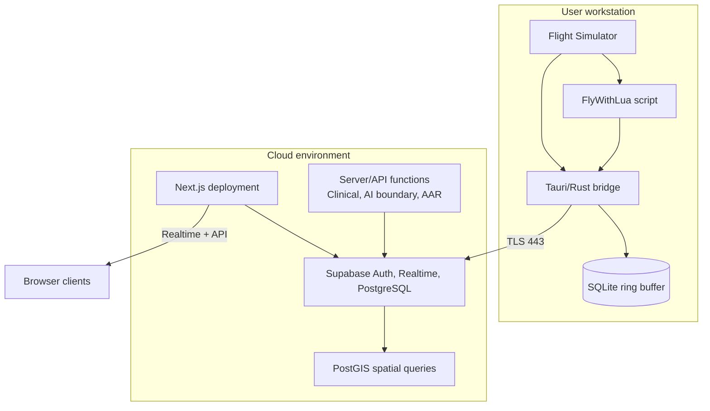

# Design Document: Helicopter Simulation Application

**Feature:** `helicopter-simulation`  
**Workflow:** Design-first  
**Design artifacts:** High-Level Design + Low-Level Design  
**Status:** Technical design specification; no application implementation included  
**Notation:** Structured pseudocode for all low-level contracts and algorithms  
**Source of truth:** `.kilo/docs/ARCHITECTURE.md`, `REQUIREMENTS.md`, `FRAMEWORK.md`, `TECH-STACK.md`, `APP-MAP.md`, `BLUEPRINT.md`, `HEMS Service Overview.md`, `POH.md`, `SCHEMATICS.md`, Module 2, Module 3, Module 4, `TASKS.md`, `REQUIRED-DOCUMENTS.md`, and `DOCUMENT-STRUCTURE.md`.

## Overview

Virtual HEMS is a flight-following, mission-dispatch, clinical simulation, and safety-management platform for helicopter simulation. It connects Microsoft Flight Simulator 2020/2024 and X-Plane 11/12 to a cross-platform desktop bridge, a Supabase/PostgreSQL/PostGIS backend, and a Next.js web command terminal with a live theater map, four-stage dispatcher, cockpit EFB, clinical deterioration model, and automated after-action review.

The design preserves the documented operating model: authentic regional HEMS simulation modeled on STAT MedEvac and AHN LifeFlight, Western Pennsylvania and tri-state infrastructure, approved EC135/EC145/H135/Bell 407 fleet profiles, procedural flight and systems training, non-punitive safety reporting, and auditable mission records. The design is deliberately implementation-neutral where the source documents leave behavior to later requirements or engineering decisions.

### 1.1 Design goals

- Provide one normalized telemetry contract for MSFS and X-Plane.
- Deliver 2–10 Hz sampling, delta-compressed uplink, sub-second live fanout, and lossless offline recovery.
- Make mission dispatch a gated four-stage workflow: Details, Crew, Patient Info, Flight Plan.
- Model Golden Hour timing, on-scene delay, patient deterioration, destination capability, and mission scoring.
- Preserve flight-operations concepts from the POH and modules: CPDS/VEMD/FLI, AFCS/SAS/trim, LZ reconnaissance, fuel margins, emergency events, and AAR metrics.
- Enforce authenticated access, PostgreSQL RLS, data minimization, and integrity/reliability/service principles.
- Support later phased implementation without coupling the web client directly to simulator-specific protocols.

### 1.2 Non-goals

- This document does not implement application code, database migrations, simulator plugins, deployment files, or UI components.
- The platform is a simulation and training system, not a real-world dispatch, medical decision, or aviation safety authority.
- Real patient identifiers and real clinical records are out of scope; scenarios use simulated, minimized data.
- The design does not select a specific AI model, weather provider, mapping vendor, or voice service beyond documented integration boundaries.

## 2. Architectural Principles and Constraints

1. **Integrity:** Telemetry, mission events, weather observations, decisions, and incident reports are append-only or auditable where practical; corrections retain provenance.
2. **Reliability:** Local bridge buffering and deterministic replay prevent network loss from silently removing flight data.
3. **Service:** The simulated patient and crew context are treated with dignity; public feeds expose only non-identifying operational information.
4. **Separation of concerns:** Simulator adapters produce normalized frames; the bridge owns buffering and transport; the cloud owns persistence, authorization, derived state, and fanout; clients render operational views.
5. **Contract-first interoperability:** Shared telemetry, medical, dispatch, and AAR contracts are versioned and validated at each boundary.
6. **Safety-gated workflow:** A mission cannot be transmitted to the EFB until required dispatch, clinical, risk, weather, and reserve checks pass or an explicit training override is recorded.
7. **Deterministic core:** Clinical decay, fuel/reserve checks, flight-envelope checks, and AAR calculations must be deterministic and testable independently of UI and AI.
8. **Graceful degradation:** Live map, AI briefing, weather, and cloud services may degrade independently; the bridge and EFB show stale/degraded status rather than fabricating values.
9. **Cross-platform operation:** The bridge targets Windows 10/11 x86_64 and macOS x86_64/aarch64; the web terminal is browser-based and responsive for desktop, tablet, and cockpit use.

## Architecture

### 3.1 System context



### 3.2 Logical component model

| Component | Responsibility | Primary boundary |
|---|---|---|
| MSFS adapter | Read SimConnect rotorcraft state and map it to normalized telemetry | Native simulator API to bridge adapter |
| X-Plane adapter | Receive FlyWithLua JSON over `127.0.0.1:8080`, validate and map units | UDP socket to bridge adapter |
| Bridge runtime | Sample, normalize, timestamp, delta-compress, queue, retry, publish health | Local process to TLS uplink |
| Offline ring buffer | Persist unsent frames/events and replay in sequence after reconnect | Local SQLite boundary |
| Telemetry ingestion API | Authenticate, validate, persist telemetry, broadcast latest state | HTTP/WebSocket to cloud |
| Realtime channel | Fan out current asset state and mission updates to authorized clients | Supabase Realtime |
| Mission service | Create and transition missions through documented states | Web/API to PostgreSQL |
| Dispatch planner | Four gated stages and PAVE/fuel/weather validation | Web client to mission service |
| Clinical engine | Condition matrix lookup, Golden Hour timer, GCS/vital state derivation | Mission state to clinical state |
| Ironpine briefing boundary | Generate tactical facility/LZ recommendations with explainable inputs | Server-side API boundary |
| AAR engine | Audit telemetry, route, pitch/roll, G-force, fuel, timeline, and score | Touchdown event to report |
| Command map | Render assets, bases, hospitals, LZs, routes, and status | Realtime client subscription |
| Cockpit EFB | Display mission package, patient state, checklists, navigation/LZ data, and degraded status | Authenticated client |
| Safety/VIRS | Capture non-punitive incident narratives and operational metadata | Authenticated web/API boundary |

### 3.3 Deployment topology



The documented production direction is Vercel for the web terminal, Supabase Cloud in US-East-1 for the database/realtime layer, and GitHub Releases or a static CDN for desktop installers. CI/CD must run web lint/typecheck/build and cross-platform bridge builds; exact workflows are implementation tasks, not part of this artifact.

### 3.4 Main operational sequence: dispatch through AAR

```mermaid
sequenceDiagram
  actor Crew as Pilot/Dispatcher
  participant Web as Web Terminal
  participant Mission as Mission Service
  participant Clinical as Clinical Engine
  participant AI as Ironpine Boundary
  participant Bridge as Desktop Bridge
  participant Sim as Simulator
  participant Cloud as Supabase/PostGIS
  participant EFB as Cockpit EFB
  participant AAR as AAR Engine

  Crew->>Web: Start mission
  Web->>Mission: Stage 1 details, base, asset, weather
  Mission-->>Web: Validated stage state
  Crew->>Web: Assign PIC/nurse/paramedic
  Web->>Mission: Stage 2 roster
  Crew->>Web: Enter simulated patient and condition
  Web->>Clinical: Resolve condition and baseline state
  Web->>AI: Request briefing with patient, weather, route, LZ inputs
  AI-->>Web: Facility/LZ recommendations with provenance
  Crew->>Web: Complete PAVE and reserve checks
  Web->>Mission: Authorize mission
  Mission->>EFB: Push mission package and start Golden Hour
  Sim->>Bridge: Simulator vectors
  Bridge->>Cloud: Normalized telemetry frames
  Cloud-->>Web: Realtime asset state
  Cloud-->>EFB: Realtime telemetry and patient state
  Crew->>EFB: Scene arrival, departure, status events
  EFB->>Clinical: Update scene elapsed time (independent destination)
  EFB->>Mission: Record event (independent destination)
  Note over EFB,Mission: Clinical and Mission submissions are independent; on partial failure the EFB retries only the failed destination and never resubmits the one that succeeded
  Clinical-->>EFB: GCS/vitals state
  Sim->>Bridge: Touchdown telemetry/event
  Bridge->>Cloud: Final telemetry and touchdown event
  Cloud->>AAR: Trigger mission audit
  AAR-->>Web: Performance report and score
  AAR->>Cloud: Persist report and pilot logbook update
```

### 3.5 Web route and client surface

The route structure follows `APP-MAP.md` and the task/document guidance:

- Public: `/`, `/about`, `/safety`, `/fleet`, `/network`, `/downloads`, `/contact`.
- Authentication: `/login`, `/register`.
- Authenticated operations: `/dashboard/command`, `/dashboard/dispatcher`, `/dashboard/efb`, `/dashboard/hospitals`, `/dashboard/logbook`, `/dashboard/archive`, `/dashboard/sms-report`.
- API boundaries: `/api/telemetry`, `/api/dispatch/ai-briefing`, `/api/aar`, plus hospital and VIRS operations as required by the application map.
- Dispatcher components: `Step1Details`, `Step2Crew`, `Step3PatientInfo`, `Step4FlightPlan`.
- Map components: theater map, asset marker, helipad/LZ overlay.
- EFB components: patient vitals, checklist, navigation/briefing, mission status.

The design treats the path variants in source documents (`/command` versus `/dashboard/command`) as a later routing decision. A requirements phase must choose one canonical authenticated route form. Where an alternate documented path form is distinct from the canonical form, requests to the alternate form redirect to the canonical form; where the alternate form is identical to the canonical form, the request is already canonical and no redirect is issued.

## Components and Interfaces

### 4.1 Simulator adapter contract

```pascal
INTERFACE SimulatorAdapter
  FUNCTION connect() RETURNS AdapterResult
  FUNCTION disconnect() RETURNS AdapterResult
  FUNCTION sample(now: Timestamp) RETURNS Result<TelemetrySample, AdapterError>
  FUNCTION health() RETURNS AdapterHealth
END INTERFACE

STRUCTURE TelemetrySample
  source_engine: SimulatorEngine
  source_sequence: Integer
  observed_at: Timestamp
  position: PositionVector
  flight: FlightVector
  systems: SystemsVector
END STRUCTURE
```

Adapters must not persist data, call cloud services, or expose simulator-specific field names beyond their implementation boundary. They must identify the source engine as `MSFS2020`, `MSFS2024`, `XPLANE11`, or `XPLANE12` and normalize units to the shared contract.

### 4.2 Bridge runtime contract

```pascal
INTERFACE BridgeRuntime
  FUNCTION start(configuration: BridgeConfiguration) RETURNS Result<BridgeSession, BridgeError>
  FUNCTION stop() RETURNS Result<void, BridgeError>
  FUNCTION register_adapter(adapter: SimulatorAdapter) RETURNS Result<void, BridgeError>
  FUNCTION connection_status() RETURNS BridgeStatus
  FUNCTION flush_offline_queue() RETURNS FlushSummary
END INTERFACE

STRUCTURE BridgeConfiguration
  pilot_id: UUID
  mission_id: Optional<UUID>
  sample_rate_hz: Decimal         // constrained to 2..10
  udp_bind_address: String        // documented default 127.0.0.1:8080
  uplink_endpoint: URL
  api_key_reference: SecretReference
  offline_capacity: Integer
END STRUCTURE
```

### 4.3 Telemetry contract

```pascal
ENUM SimulatorEngine = { MSFS2020, MSFS2024, XPLANE11, XPLANE12 }

STRUCTURE PositionVector
  latitude_deg: Decimal
  longitude_deg: Decimal
  altitude_msl_ft: Decimal
  altitude_agl_ft: Decimal
END STRUCTURE

STRUCTURE FlightVector
  ground_speed_kts: Decimal
  heading_deg: Decimal
  vertical_speed_fpm: Decimal
  pitch_deg: Decimal
  roll_deg: Decimal
END STRUCTURE

STRUCTURE SystemsVector
  fuel_remaining_lbs: Decimal
  engine_torque_pct: Decimal
  tot_celsius: Optional<Decimal>
  rotor_rpm_pct: Optional<Decimal>
  outside_air_temp_c: Optional<Decimal>
END STRUCTURE

STRUCTURE TelemetryFrame
  frame_id: UUID
  pilot_id: UUID
  mission_id: Optional<UUID>
  source_engine: SimulatorEngine
  sequence_number: Integer
  observed_at: Timestamp
  received_at: Optional<Timestamp>
  position: PositionVector
  flight: FlightVector
  systems: SystemsVector
  is_delta: Boolean
  schema_version: String
END STRUCTURE
```

Validation must reject invalid coordinates, unsupported engines, non-finite numeric values, impossible headings, and sequence regressions unless the frame is explicitly marked as replayed historical data.

### 4.4 Mission and dispatch contracts

```pascal
ENUM MissionType = { SCENE_CALL, INTER_FACILITY_TRANSFER }
ENUM MissionStatus = { DISPATCHED, EN_ROUTE_SCENE, ON_SCENE, EN_ROUTE_HOSPITAL, COMPLETED, ABORTED }
ENUM PatientPriority = { PRIORITY_1, PRIORITY_2, PRIORITY_3 }

STRUCTURE CrewRoster
  pilot_in_command_id: UUID
  flight_nurse_id: Optional<UUID>
  flight_paramedic_id: Optional<UUID>
END STRUCTURE

STRUCTURE DispatchDetails
  mission_type: MissionType
  assigned_base_id: UUID
  assigned_airframe_id: UUID
  origin_hospital_id: Optional<UUID>
  scene_coordinates: Optional<GeoPoint>
  destination_hospital_id: UUID
  weather_snapshot: WeatherSnapshot
END STRUCTURE

STRUCTURE PatientInput
  simulated_patient_id: UUID
  age_years: Integer
  gender: String
  weight_lbs: Integer
  condition_id: UUID
  clinical_summary: String
  interventions: String
  baseline_gcs: Integer
END STRUCTURE

STRUCTURE PAVERisk
  pilot_score: Integer
  aircraft_score: Integer
  environment_score: Integer
  external_score: Integer
  total_score: Integer
  disposition: { GO, CONDITIONAL, NO_GO }
  rationale: List<String>
END STRUCTURE

STRUCTURE FlightPlan
  route: List<GeoPoint>
  direct_distance_nm: Decimal
  planned_distance_nm: Decimal
  estimated_fuel_burn_lbs: Decimal
  reserve_requirement_minutes: Integer
  reserve_at_destination_minutes: Decimal
END STRUCTURE

STRUCTURE MissionDispatch
  mission_id: UUID
  mission_code: String
  details: DispatchDetails
  crew: CrewRoster
  patient: PatientInput
  risk: PAVERisk
  flight_plan: FlightPlan
  status: MissionStatus
  authorization_code: Optional<String>
END STRUCTURE
```

### 4.5 Clinical contracts

```pascal
STRUCTURE MedicalCondition
  id: UUID
  icd_code: Optional<String>
  name: String
  category: { TRAUMA, CARDIAC, STROKE, NEURO, OB, PEDIATRIC, ENVIRONMENTAL, OTHER }
  baseline_gcs_min: Integer
  baseline_gcs_max: Integer
  requires_rsi: Boolean
  decay_rate_per_minute: Decimal
  target_facility_type: String
END STRUCTURE

STRUCTURE PatientState
  mission_id: UUID
  baseline_gcs: Integer
  current_gcs: Integer
  elapsed_golden_hour_seconds: Integer
  elapsed_scene_seconds: Integer
  physiological_flags: Set<String>
  deteriorated: Boolean
  updated_at: Timestamp
END STRUCTURE

STRUCTURE ClinicalEvent
  mission_id: UUID
  event_type: { DISPATCHED, ARRIVED_SCENE, DEPARTED_SCENE, INTERVENTION, TOUCHDOWN, ABORTED }
  occurred_at: Timestamp
  source: { USER, TELEMETRY, SYSTEM }
  metadata: Map<String, String>
END STRUCTURE
```

The exact decay curve and threshold behavior must be finalized during requirements derivation. The source documents establish a 60-minute Golden Hour and a 15-minute on-scene target/threshold, but also contain references to a 10–15 minute range; the implementation must not silently choose between them.

### 4.6 Infrastructure and AAR contracts

```pascal
STRUCTURE Helipad
  id: UUID
  name: String
  faa_id: String
  city: String
  state: String
  elevation_ft: Decimal
  coordinates: GeoPoint
  surface: { CONCRETE, ASPHALT, MAT, OTHER }
  placement: { ROOFTOP, GROUND }
  dimensions_ft: String
  capability: String
END STRUCTURE

STRUCTURE TacticalBriefing
  recommended_facility_id: Optional<UUID>
  recommended_lz: Optional<GeoPoint>
  warnings: List<String>
  assumptions: List<String>
  input_snapshot_hash: String
  generated_at: Timestamp
  provenance: String
END STRUCTURE

STRUCTURE AARReport
  mission_id: UUID
  telemetry_coverage: Decimal
  route_efficiency_percent: Decimal
  max_pitch_deg: Decimal
  max_roll_deg: Decimal
  touchdown_g_force: Optional<Decimal>
  reserve_fuel_minutes: Decimal
  scene_time_minutes: Decimal
  clinical_outcome_summary: String
  compliance_findings: List<String>
  score: Decimal
  generated_at: Timestamp
END STRUCTURE
```

## Data Models

### 5.1 Core relational entities

The relational model follows the documented migration design:

- `profiles`: authenticated pilot identity, callsign, role, HEMS credential reference, hours, dispatch count, home base.
- `hems_bases`: provider, FAA identifier, facility name, elevation, PostGIS point, airframe type, tail number.
- `hospitals`: facility, FAA identifier, location, helipad surface/placement/dimensions/elevation, coordinates, trauma capability.
- `medical_conditions`: condition identity/category, ICD reference, GCS range, RSI flag, decay rate, receiving capability.
- `missions`: mission code/type/status/priority, pilot/base/facility references, scene coordinates, simulated patient fields, clinical text, lifecycle timestamps.
- `flight_telemetry`: mission/pilot/engine, normalized vectors, systems state, timestamp, sequence and schema metadata.
- `mission_events`: append-only lifecycle, checklist, communication, and authorization events.
- `clinical_snapshots`: derived patient state at event or configured cadence.
- `tactical_briefings`: generated recommendations, input hash, warnings, provenance, and reviewer/override metadata.
- `aar_reports`: immutable report version plus score components and findings.
- `virs_reports`: non-punitive incident reports with access controls and redaction status.
- `audit_log`: actor, action, target, timestamp, correlation ID, and before/after metadata where permitted.

### 5.2 Spatial and temporal rules

- Store geographic points as PostGIS `GEOGRAPHY(POINT, 4326)` consistent with the source schemas.
- Index base, hospital, and scene geometry with GIST indexes.
- Index telemetry by mission and descending timestamp; support retention/partitioning planning for high-rate streams.
- Preserve source and observed timestamps separately from cloud receive timestamps.
- Use UTC timestamps and explicit schema versions.
- Store telemetry precision sufficient for map display, route auditing, and landing-zone proximity checks.

### 5.3 Authorization model

- Supabase Auth establishes identity.
- RLS restricts pilot profile and telemetry mutations to the authenticated pilot or explicitly authorized operational role.
- Dispatcher/instructor/admin roles may view broader operational data according to policy; role expansion must be explicit.
- Patient, clinical, and VIRS records are never public.
- Public map/marketing routes receive aggregate or de-identified operational data only.
- Service-role operations are server-side, narrowly scoped, and audited.

## 6. Low-Level Design

### 6.1 Telemetry ingestion algorithm

```pascal
PROCEDURE ingest_sample(sample, configuration)
  REQUIRE sample IS WELL_FORMED
  REQUIRE configuration.sample_rate_hz BETWEEN 2 AND 10

  normalized ← normalize_units_and_names(sample)
  validated ← validate_telemetry(normalized)

  IF validated IS INVALID THEN
    record_bridge_diagnostic("invalid telemetry", validated.errors)
    RETURN Rejected(validated.errors)
  END IF

  frame ← create_frame(normalized, next_sequence(), now())
  previous ← latest_accepted_frame()

  IF previous EXISTS AND delta_is_below_threshold(frame, previous) THEN
    frame.is_delta ← TRUE
    frame ← encode_changed_fields(frame, previous)
  ELSE
    frame.is_delta ← FALSE
  END IF

  append_to_local_queue(frame)

  IF uplink_is_available() THEN
    result ← publish_queued_frames_in_sequence()
    IF result HAS FAILURE THEN
      mark_uplink_degraded(result.error)
    END IF
  ELSE
    mark_uplink_offline()
  END IF

  RETURN Accepted(frame.frame_id)
END PROCEDURE
```

**Preconditions:** adapter sample is present; engine is supported; configured rate is 2–10 Hz; pilot/session identity is authenticated or pending a controlled local queue state.  
**Postconditions:** every accepted frame has a sequence number, timestamp, schema version, and local durable queue record; no invalid frame is published.  
**Loop invariant:** queued frames remain ordered by session and sequence number; unsent frames are not deleted.  
**Failure behavior:** malformed samples are diagnosed and discarded; unavailable uplink leaves the frame in SQLite for replay.

### 6.2 Offline replay algorithm

```pascal
PROCEDURE replay_offline_queue()
  REQUIRE local_queue IS AVAILABLE

  summary ← empty_flush_summary()

  WHILE uplink_is_available() AND local_queue.has_next() DO
    frame ← local_queue.peek_oldest()
    result ← publish(frame)

    IF result IS SUCCESS THEN
      local_queue.delete(frame.frame_id)
      summary.sent ← summary.sent + 1
    ELSE IF result IS RETRYABLE THEN
      summary.deferred ← summary.deferred + 1
      BREAK
    ELSE
      local_queue.mark_failed(frame.frame_id, result.error)
      summary.failed ← summary.failed + 1
    END IF

    ASSERT local_queue.contains_only_unsent_or_failed_frames()
  END WHILE

  RETURN summary
END PROCEDURE
```

**Postconditions:** successful frames are removed only after server acknowledgement; retryable failures remain available; permanent failures are retained as diagnostics. Duplicate delivery is prevented by `(pilot_id, session_id, sequence_number)` idempotency.

### 6.3 Mission dispatch state machine

```pascal
PROCEDURE advance_dispatch(mission, requested_stage, input)
  REQUIRE mission IS AUTHORIZED_USER_VISIBLE
  REQUIRE requested_stage IS CURRENT_STAGE OR requested_stage IS PREVIOUS_STAGE

  IF requested_stage = DETAILS THEN
    validate_mission_type(input.mission_type)
    validate_base_and_asset(input.assigned_base_id, input.assigned_airframe_id)
    capture_weather_snapshot(input.weather)
    validate_origin_and_destination(input)
    mission.stage ← CREW

  ELSE IF requested_stage = CREW THEN
    // Crew validation mirrors Stage 1: on failure, return an error that
    // identifies each specific failed condition (multiple PICs, no PIC,
    // duplicate member, member with no defined role, or roster size outside
    // 2..6) while retaining previously entered Stage 2 values.
    require_pic(input.pilot_in_command_id)
    validate_crew_roles(input.crew)
    mission.crew ← input.crew
    mission.stage ← PATIENT_INFO

  ELSE IF requested_stage = PATIENT_INFO THEN
    validate_simulated_patient(input)
    condition ← lookup_condition(input.condition_id)
    input.baseline_gcs ← derive_baseline_gcs(condition, input)
    mission.patient ← input
    mission.stage ← FLIGHT_PLAN

  ELSE IF requested_stage = FLIGHT_PLAN THEN
    risk ← calculate_pave_risk(mission, input.environment)
    plan ← calculate_flight_plan(mission, input.route)
    require_reserve_margin(plan, input.reserve_policy)
    require_dispatch_disposition(risk.disposition)
    mission.risk ← risk
    mission.flight_plan ← plan
    mission.authorization_code ← issue_authorization_code(mission)
    mission.status ← DISPATCHED
    publish_mission_to_efb(mission)
  END IF

  append_mission_event(mission, "stage_advanced")
  RETURN mission
END PROCEDURE
```

**Preconditions:** authenticated actor has permission; prior stage data exists; all input is simulated and validated.  
**Postconditions:** only the next valid stage is opened; authorization occurs only after all required checks; every transition is auditable. On a failed stage validation, the planner keeps the next stage closed and returns an error identifying each specific failed condition (Stage 2 Crew mirrors Stage 1 by naming every failed crew condition) while retaining previously entered stage values.  
**Invariant:** an authorized mission always contains valid details, crew, clinical input, risk result, and flight plan.

### 6.4 Golden Hour and clinical deterioration algorithm

```pascal
PROCEDURE update_patient_state(patient, event_time, policy)
  REQUIRE patient.baseline_gcs BETWEEN 3 AND 15
  REQUIRE event_time IS NOT BEFORE patient.updated_at

  elapsed_total ← seconds_between(patient.dispatch_time, event_time)
  elapsed_scene ← calculate_scene_seconds(patient.events, event_time)
  excess_scene ← maximum(0, elapsed_scene - policy.scene_target_seconds)

  penalty ← calculate_decay_penalty(
    excess_scene,
    elapsed_total,
    patient.condition.decay_rate_per_minute,
    policy
  )

  patient.current_gcs ← maximum(3, patient.baseline_gcs - penalty.gcs_points)
  patient.elapsed_golden_hour_seconds ← elapsed_total
  patient.elapsed_scene_seconds ← elapsed_scene
  patient.physiological_flags ← derive_flags(patient, penalty, policy)
  patient.deteriorated ← patient.current_gcs < patient.baseline_gcs OR penalty.has_vital_effect
  patient.updated_at ← event_time

  RETURN patient
END PROCEDURE
```

**Policy inputs requiring requirements confirmation:** whether decay begins exactly after 15:00 or uses a 10–15 minute operational window; whether transit time contributes to decay; penalty granularity; simulated vital-sign model; treatment/intervention modifiers; timer pause semantics; and behavior after 60:00. The algorithm must clamp GCS at 3 and record the policy version used.

### 6.5 Spatial facility recommendation algorithm

```pascal
PROCEDURE recommend_facility(patient, origin, weather, constraints)
  candidates ← query_hospitals_within_region(origin, constraints.max_radius)
  eligible ← empty_list()

  FOR each hospital IN candidates DO
    IF capability_matches(patient.condition.target_facility_type, hospital.capability)
       AND helipad_is_operational(hospital, weather)
       AND route_is_permissible(origin, hospital.coordinates, constraints) THEN
      score ← score_facility(hospital, patient, weather, constraints)
      eligible.add({ hospital, score })
    END IF

    ASSERT every_added_candidate_matches_required_capability()
  END FOR

  sort_by_score_then_distance(eligible)
  RETURN create_recommendation(eligible, explain_constraints = TRUE)
END PROCEDURE
```

**Postconditions:** every recommendation includes the evaluated capability and constraints; no facility is recommended solely because it is geographically nearest; an empty result is an explicit no-match response requiring human selection or mission hold.

### 6.6 AAR audit algorithm

```pascal
PROCEDURE generate_aar(mission_id)
  mission ← load_completed_mission(mission_id)
  telemetry ← load_telemetry(mission_id)
  events ← load_mission_events(mission_id)
  policy ← load_aar_policy_version(mission)

  report ← new_aar_report(mission_id)
  report.telemetry_coverage ← calculate_coverage(telemetry, mission)
  report.route_efficiency_percent ← compare_route_to_direct_distance(telemetry, mission)
  report.max_pitch_deg ← maximum_absolute(telemetry.pitch_deg)
  report.max_roll_deg ← maximum_absolute(telemetry.roll_deg)
  report.touchdown_g_force ← identify_touchdown_g_force(telemetry, events)
  report.reserve_fuel_minutes ← calculate_reserve_at_destination(telemetry, mission)
  report.scene_time_minutes ← calculate_scene_duration(events)
  report.clinical_outcome_summary ← summarize_patient_state(mission_id)
  report.compliance_findings ← evaluate_thresholds(report, policy)
  report.score ← calculate_score(report, policy)
  report.generated_at ← now()

  // Every reported metric is derived solely from recorded telemetry and
  // mission events. The engine never substitutes a fabricated value for any
  // reported metric, regardless of whether a coverage limitation exists.
  ASSERT every_reported_metric_derived_from_recorded_evidence(report)

  persist_immutable_report(report)
  update_pilot_logbook(mission.pilot_id, mission, report)
  append_audit_event(mission_id, "aar_generated", report)

  RETURN report
END PROCEDURE
```

**Documented default audit signals:** scene time target ≤15 minutes, route deviation target ≤+10%, pitch ±15°, roll ±30°, destination reserve ≥20 minutes, touchdown G-force ≤1.5 G. These are design defaults from the clinical module and require formal requirements confirmation for airframe-specific exceptions.

**No fabrication:** The AAR_Engine derives every reported metric solely from recorded telemetry and mission events. When an evidence source is incomplete, it records the specific coverage limitation but never substitutes a fabricated value for any reported metric; the no-fabrication guarantee holds unconditionally, not only when coverage is incomplete.

### 6.7 Bridge and client degradation states

```pascal
ENUM ServiceState = { NOMINAL, DEGRADED, OFFLINE, RECOVERING, FAILED }

PROCEDURE derive_user_visible_status(bridge, cloud, data_age)
  IF bridge.connected AND cloud.connected AND data_age <= 2 seconds THEN
    RETURN NOMINAL
  ELSE IF bridge.connected AND NOT cloud.connected THEN
    RETURN OFFLINE
  ELSE IF cloud.connected AND data_age <= 10 seconds THEN
    RETURN DEGRADED
  ELSE IF bridge.reconnecting OR cloud.reconnecting THEN
    RETURN RECOVERING
  ELSE
    RETURN FAILED
  END IF
END PROCEDURE
```

Clients must display status and last-known timestamp, disable actions that require authoritative current data, and never substitute fabricated telemetry or clinical values.

## Correctness Properties

The following properties summarize the design invariants that must hold across adapters, bridge persistence, mission dispatch, clinical state, spatial recommendations, and reporting:

### Property 1: Telemetry validity

Every accepted telemetry frame uses a supported simulator engine, finite normalized values, a schema version, a timestamp, and a monotonically increasing session sequence; invalid frames are never published.

**Validates: Requirements 1.1**

### Property 2: Durable delivery

A frame or event is removed from the local queue only after server acknowledgement, and replay is idempotent for the pilot/session/sequence identity.

**Validates: Requirements 2.1**

### Property 3: Dispatch gating

A mission cannot become `DISPATCHED` or reach the EFB until the required details, crew, simulated patient, PAVE disposition, flight plan, and reserve checks are valid; each transition is auditable.

**Validates: Requirements 3.1**

### Property 4: Clinical monotonicity

Patient elapsed time and event-derived state advance monotonically by policy version, GCS remains within 3–15, and deterioration is derived deterministically from the recorded inputs.

**Validates: Requirements 4.1**

### Property 5: Recommendation safety

Every recommended facility satisfies the applicable capability, helipad, weather, and route constraints, or the system returns an explicit no-match result rather than silently selecting an unsafe facility.

**Validates: Requirements 5.1**

### Property 6: Auditability

A completed mission’s AAR retains the policy/version context and reports the available telemetry, route, flight-envelope, reserve, timeline, and clinical evidence, deriving every reported metric solely from recorded evidence and never substituting a fabricated value for any reported metric, regardless of whether a coverage limitation exists.

**Validates: Requirements 6.1**

### Property 7: Degraded-state honesty

When bridge, cloud, weather, realtime, or AI services are unavailable, clients expose the degraded or stale state and do not substitute fabricated telemetry, clinical values, or recommendations.

**Validates: Requirements 7.1**

## Error Handling

| Scenario | Required behavior |
|---|---|
| Simulator unavailable | Bridge reports adapter health, keeps UI session available, and does not emit synthetic frames. |
| Malformed UDP/SimConnect sample | Reject sample, record diagnostic, continue listener loop. |
| Unsupported engine/version | Show actionable compatibility error; do not coerce unknown fields. |
| Network disconnect | Persist frames/events locally, show offline state, replay in sequence after reconnect. |
| Queue capacity reached | Apply configured retention/backpressure policy, alert user, retain oldest or highest-priority records according to requirements; never silently discard. |
| Authentication expiry | Stop cloud mutation, retain local data encrypted, require re-authentication before replay. |
| Realtime channel interruption | Keep last-known values with age indicator and resubscribe with bounded retry. |
| Weather unavailable/stale | Mark weather stale and prevent automatic GO authorization if policy requires current weather. |
| AI briefing unavailable | Return deterministic facility/LZ query alternatives and clearly mark AI output absent. |
| No eligible receiving facility | Hold or require explicit authorized selection with rationale; do not auto-select an unsafe match. |
| Clinical policy mismatch | Block state transition and surface policy version/error for instructor/admin resolution. |
| Touchdown not detected | Permit manual authorized completion event with provenance; mark AAR telemetry coverage limitation. |
| AAR metric evidence incomplete | Record the specific coverage limitation; never substitute a fabricated value for any reported metric (no-fabrication holds unconditionally). |
| EFB event submission partial failure | Treat the Clinical_Engine and Mission_Service as independent destinations; retain event data and retry only the failed destination, never resubmitting the destination that already succeeded, and show a partial-failure indication naming the failed destination. |
| TLS below 1.2 negotiated | Treat a session that negotiates a TLS version below 1.2 as equivalent to a session that cannot be established: abort the transmission and send no telemetry over that session. |
| Database write failure | Return correlation ID, retry idempotently, preserve local event where bridge-originated, and alert operational UI. |
| VIRS submission failure | Preserve draft locally where permitted, avoid exposing narrative publicly, and show submission status. |

## 9. Security, Privacy, and Safety Considerations

- Authenticate all operational routes and bridge sessions with short-lived credentials or securely referenced API keys.
- Apply RLS to profiles, missions, telemetry, clinical snapshots, briefings, AARs, and VIRS records.
- Encrypt bridge-to-cloud traffic with TLS 1.2 or higher; abort transmission and send no telemetry if a TLS session cannot be established, treating a session that negotiates a TLS version below 1.2 as equivalent to one that cannot be established. Protect local SQLite data at rest according to platform capability.
- Never place service-role secrets in the browser or desktop package.
- Sanitize simulated clinical text and reject real-world patient identifiers where detectable; document the simulation-only policy.
- Treat AI output as advisory and non-authoritative. Persist input assumptions, output provenance, and any human override.
- Keep public safety charter, CRM, VIRS, and operational transparency content separate from private mission/clinical data.
- Audit authorization, mission state changes, telemetry replay, clinical policy changes, AI overrides, and AAR publication.
- Use least privilege for trainee, officer, captain, instructor, and admin roles.
- Provide clear visual cues for stale telemetry, stale weather, offline queue depth, clinical timer state, and unresolved warnings.

## 10. Performance and Scalability

### 10.1 Targets from source documentation

- Telemetry sampling: 2–10 Hz adaptive rate.
- Live uplink/fanout: sub-second target under nominal connectivity.
- Local X-Plane listener: `127.0.0.1:8080`.
- Supported bridge targets: Windows 10/11 x86_64 and macOS x86_64/aarch64.
- Spatial queries: indexed PostGIS proximity, radial, elevation, and route-support operations.

### 9.2 Design tactics

- Use delta compression only after validation and retain periodic full snapshots for recovery.
- Separate hot latest-state/realtime storage from historical telemetry analytics and define retention/partition policy during implementation planning.
- Batch offline replay with bounded payloads and idempotency keys.
- Keep map rendering subscriptions scoped by region, mission, role, and viewport.
- Compute expensive AAR aggregates asynchronously after touchdown while exposing processing status.
- Cache static infrastructure and condition matrix data with versioned invalidation.
- Ensure clinical updates are monotonic by event time and policy version.

## Testing Strategy

### 11.1 Unit and contract tests

- Validate simulator adapter mappings, unit conversions, supported-engine enumeration, and malformed input rejection.
- Test telemetry schema, sequence/idempotency behavior, delta reconstruction, and queue replay.
- Test dispatch stage gates, mission transitions, authorization conditions, and role permissions.
- Test PostGIS coordinate, radius, elevation, capability, and helipad constraint queries.
- Test clinical decay boundaries, GCS clamp, timer pause/resume, intervention modifiers, and policy versioning.
- Test PAVE and reserve calculations for normal, boundary, and no-go scenarios.
- Test AAR metrics against known telemetry fixtures and incomplete-data behavior.
- Test public/private redaction and RLS policy contracts.

### 11.2 Integration and end-to-end tests

1. MSFS fixture → bridge → normalized telemetry → cloud persistence → realtime map/EFB.
2. X-Plane UDP fixture on port 8080 → bridge → same normalized path.
3. Network fault simulation → SQLite buffering → reconnect replay with no loss or duplicate mission frames.
4. Four-stage dispatch → authorized mission → EFB package → lifecycle events.
5. Twenty-minute simulated scene delay → clinical deterioration state and visible EFB update.
6. AI briefing request with valid and unavailable AI boundary → deterministic fallback behavior.
7. Hospital touchdown → AAR generation → logbook and archive update.
8. RLS matrix across trainee, operational, instructor, and admin roles.
9. Full mission lifecycle: dispatch → flight → scene → hot load → hospital landing → AAR.

### 11.3 Operational verification matrix

| Area | Evidence | Pass condition |
|---|---|---|
| Telemetry | Concurrent MSFS/X-Plane fixtures | Both map to the same contract and stream within target latency |
| Failover | Forced network outage | No acknowledged frame is lost; queued frames replay idempotently |
| PostGIS | Known PS78/KAXQ and regional fixtures | Correct distance, elevation, and capability filtering |
| Dispatch | Four-stage journey | Mission record is valid and EFB package is delivered only after gates |
| Clinical | Boundary-time simulations | Golden Hour and on-scene policy produce deterministic state changes |
| AAR | Touchdown fixture | Report contains telemetry, route, flight-envelope, reserve, and timeline findings |
| Security | RLS/auth test matrix | Unauthorized reads/writes are rejected and audited |
| Safety | VIRS/public route test | Incident data remains non-punitive, private, and redacted as required |

## 12. Dependencies and External Boundaries

- Next.js 14+ App Router, React, Tailwind CSS, and Framer Motion for the web terminal.
- Tauri v2/Rust for the desktop bridge; Tokio/Serde-style capabilities are anticipated by the source documents.
- MSFS SimConnect SDK and X-Plane FlyWithLua plus localhost UDP sockets.
- Supabase Auth, Realtime, PostgreSQL 15+, PostGIS, and database RLS.
- Leaflet or Mapbox GL JS for the regional map; final selection remains an implementation decision.
- Ironpine AI tactical briefing boundary; model/provider and prompt governance remain to be specified.
- METAR/TAF weather source; provider, freshness SLA, and failure policy remain to be specified.
- Vercel, GitHub Actions, GitHub Releases/static CDN for documented deployment direction.
- Regional infrastructure and clinical seed datasets described in the project documentation.

## 13. Open Decisions for Requirements Derivation

1. Canonical route form: `/command` versus `/dashboard/command` and equivalent authenticated routes.
2. Exact Golden Hour decay formula, whether transit contributes, and how interventions affect decay.
3. The source documents state both a 15-minute target and a 10–15 minute operational range; define one normative policy plus any airframe/mission exceptions.
4. Approved airframe catalog includes Bell 407 in requirements, while several schema examples focus on EC135/EC145/H135; define fleet registry and capability mapping for all approved aircraft.
5. Whether `tot_celsius`, rotor RPM, OAT, touchdown G-force, and other fields are mandatory across all simulator adapters or optional with coverage flags.
6. Telemetry retention, partitioning, aggregation, and privacy schedule.
7. Exact trainee/officer/captain/instructor/admin permissions and instructor override workflow.
8. AI briefing explainability, human approval, provider, data residency, failure fallback, and cost limits.
9. Weather provider, freshness threshold, METAR/TAF parsing contract, and offline behavior.
10. PAVE scoring scale, fuel reserve policy for VFR/IFR, and airframe-specific performance rules.
11. Touchdown/event detection sources and manual event authorization.
12. Voice/radio integration scope, if any, beyond the documented push-to-talk and patch-call concepts.
13. Installer/update/signing requirements for Windows and macOS bridge releases.
14. Training scenario authoring, seeding, reset, replay, and instructor observation capabilities.
15. Whether the map supports 106+ medical nodes at initial release or phases the regional dataset.

## 14. Implementation Planning Alignment

The later requirements and task phases should follow the source `TASKS.md` sequence:

- **Phase 1:** Turborepo foundation, shared contracts, PostgreSQL/PostGIS schema, RLS, and regional/clinical seeds.
- **Phase 2:** Tauri/Rust bridge, X-Plane UDP plugin, MSFS SimConnect adapter, normalization, delta compression, SQLite failover, TLS uplink.
- **Phase 3:** Next.js routes, command map, dispatcher, EFB, Golden Hour engine, Ironpine boundary, and AAR.
- **Phase 4:** Regional verification, security/privacy audit, cross-platform release, CI/CD, and full lifecycle acceptance test.

The design is complete enough to derive formal requirements and implementation tasks, but the open decisions above must be resolved before locking detailed acceptance criteria.
